# Raport z listy 1

W zadaniach generujemy wektory obserwacji z różnych rozkładów a następnie porównujemy dla nich różne estymatory.

Oznaczenia przyjmuję analogiczne do treści zadań. W wykresach stosuję często 'Theta_i' zamiast $\theta_i$.

Do porównania estymatorów stosuje wykresy zgodnie z treścią zadań oraz charakterystyki:

- $bias(\hat{\theta}) = E\hat{\theta} - \theta$

- $var(\hat{\theta}) = E(\hat{\theta} - E\hat{\theta})^2$

- $MSE(\hat{\theta}) = E(\hat{\theta} - \theta)^2 = bias^2(\hat{\theta}) + var(\hat{\theta})$

## Zadanie 1
Estymatory są oznaczone zgodnie z treścią zadania. Jako własny estymator wybrałem $trimmed$ $mean$, który sortuje wartości i odrzuca kilka największych i kilka najmniejszych z nich. W moim przypadku 10% najmniejszych i 10% największych wartości. Taki estymator powinien być mniej wrażliwy na odstające wartości niż zwykła średnia.

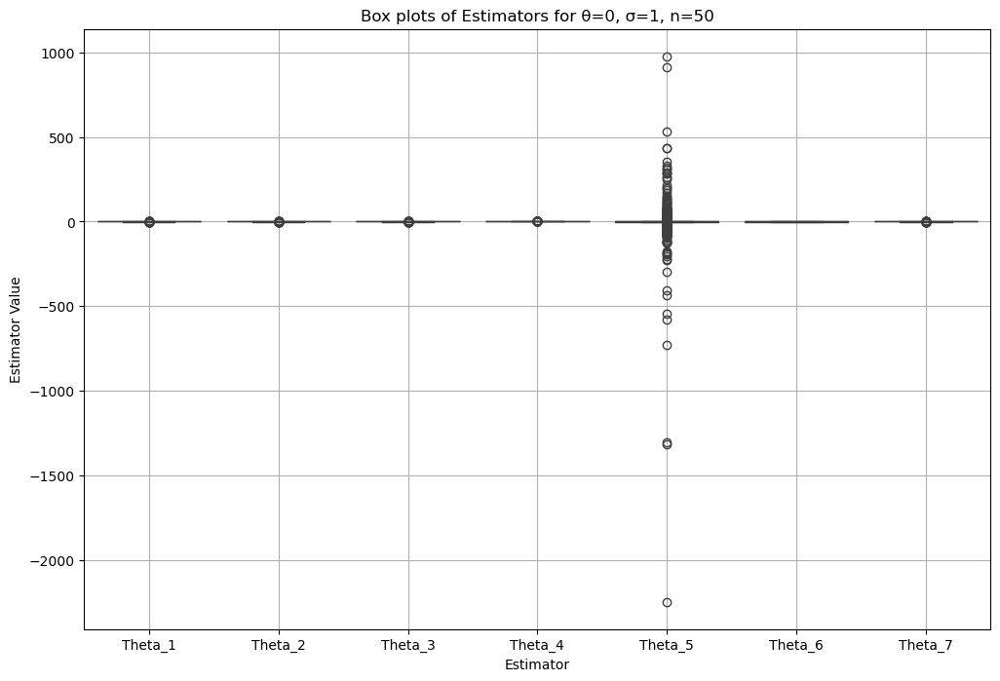

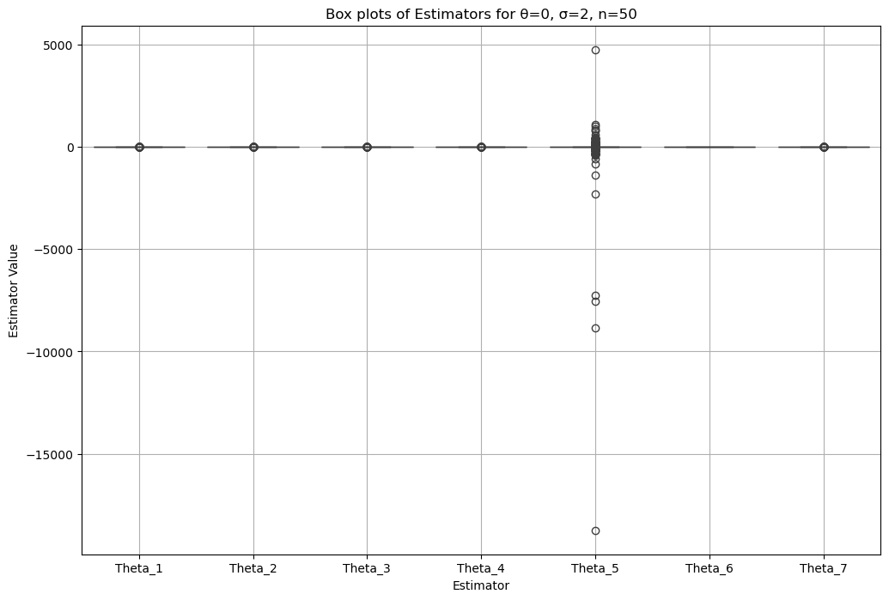

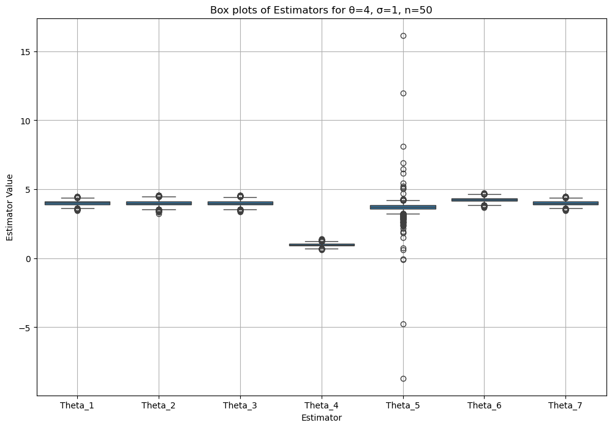

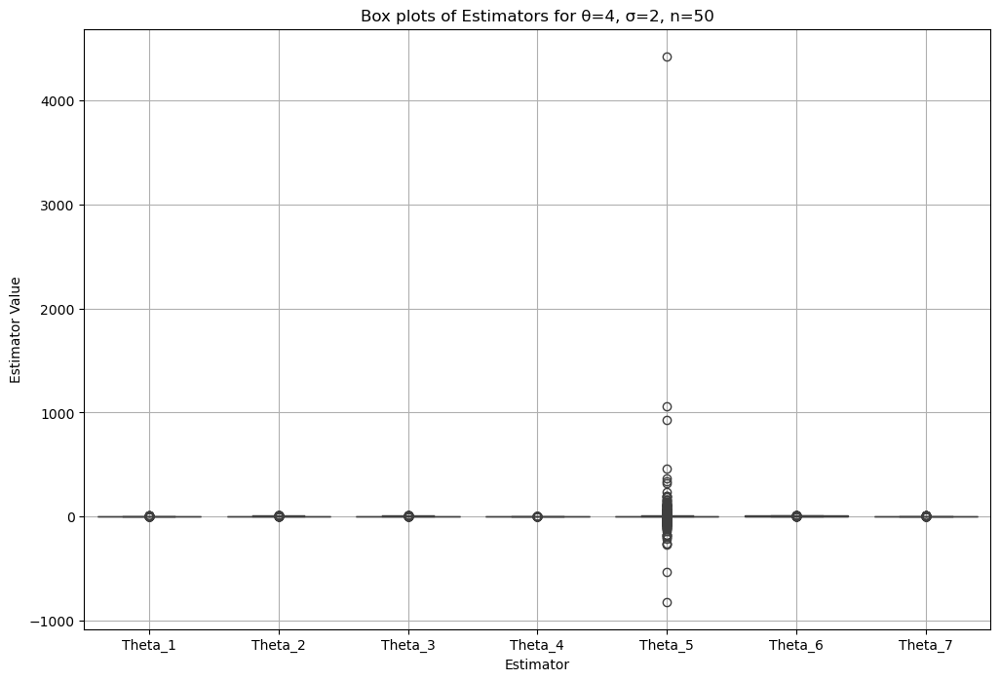

**Komentarz:**
$\hat\theta_5$ znacząco zaburza wykres przez outliery. Pojawiają się one gdy mianownik w średniej harmonicznej jest bliski $0$. Wtedy średnia potrafi być bardzo daleko od $\theta$. Widać to bardziej w przypadku gdy $\theta = 0$ bo wartości $X_i$ są skupione wokół $0$. Z tego powodu zamieszczam pełne wykresy tylko dla $n=50$. Kolejne wykresy zamieszczam już bez tego estymatora.

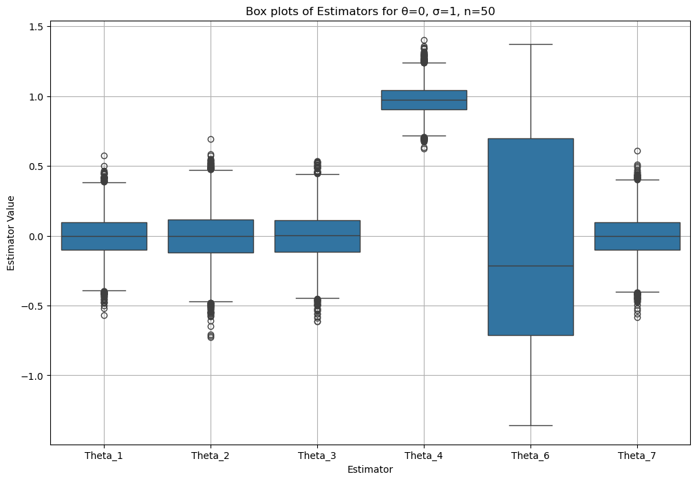

**Podsumowanie estymatorów dla $\theta$=0, $\sigma$=1, n=50** 

| estimator   |      variance |         bias |          mse |
|:------------|--------------:|-------------:|-------------:|
| Theta_1     |    0.0204835  | -0.0025871   |    0.0204902 |
| Theta_2     |    0.0311175  | -0.000905165 |    0.0311183 |
| Theta_3     |    0.0278457  | -0.00208471  |    0.0278501 |
| Theta_4     |    0.00978646 |  0.973451    |    0.957394  |
| Theta_5     | 1480.16       | -0.0212943   | 1480.16      |
| Theta_6     |    0.525383   | -0.0117048   |    0.52552   |
| Theta_7     |    0.0217319  | -0.00236031  |    0.0217375 |

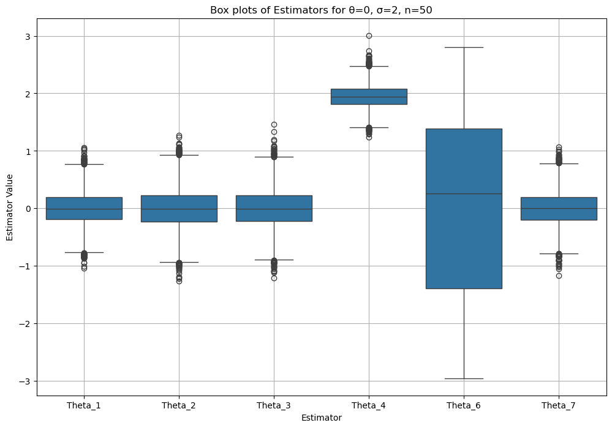

**Podsumowanie estymatorów dla $\theta$=0, $\sigma$=2, n=50** 

| estimator   |      variance |        bias |           mse |
|:------------|--------------:|------------:|--------------:|
| Theta_1     |     0.0805862 | -0.0015959  |     0.0805887 |
| Theta_2     |     0.122034  | -0.00324556 |     0.122045  |
| Theta_3     |     0.109046  | -0.00226918 |     0.109051  |
| Theta_4     |     0.0389745 |  1.94186    |     3.8098    |
| Theta_5     | 57873.4       | -3.69233    | 57887.1       |
| Theta_6     |     2.08224   |  0.00156554 |     2.08224   |
| Theta_7     |     0.0852446 | -0.00177263 |     0.0852478 |

**Podsumowanie estymatorów dla $\theta$=4, $\sigma$=1, n=50** 

| estimator   |   variance |         bias |       mse |
|:------------|-----------:|-------------:|----------:|
| Theta_1     | 0.0201919  | -0.00076519  | 0.0201925 |
| Theta_2     | 0.0306954  | -0.00163849  | 0.0306981 |
| Theta_3     | 0.0273264  | -0.000327248 | 0.0273265 |
| Theta_4     | 0.00982365 | -3.0283      | 9.1804    |
| Theta_5     | 0.0915559  | -0.292986    | 0.177397  |
| Theta_6     | 0.0202126  |  0.230716    | 0.0734425 |
| Theta_7     | 0.0214451  | -0.000804182 | 0.0214458 |

**Podsumowanie estymatorów dla $\theta$=4, $\sigma$=2, n=50** 

| estimator   |     variance |        bias |          mse |
|:------------|-------------:|------------:|-------------:|
| Theta_1     |    0.0793975 | -0.00380457 |    0.079412  |
| Theta_2     |    0.123074  | -0.00256026 |    0.12308   |
| Theta_3     |    0.106963  | -0.00300974 |    0.106972  |
| Theta_4     |    0.0387001 | -2.06098    |    4.28635   |
| Theta_5     | 2450.72      | -0.510769   | 2450.98      |
| Theta_6     |    0.0781065 |  0.798689   |    0.71601   |
| Theta_7     |    0.0840545 | -0.00376679 |    0.0840687 |

**Komentarz:**

- $\hat\theta_1$ (średnia) jest najlepszym estymatorem. Jest nieobciążony i ma najmniejszy mse. Analogicznie $\hat\theta_7$ co wynika z doboru tego estymatora, ale o tym za chwilę.

- $\hat\theta_2$ (mediana) również jest nieobciążonym estymatorem, jednak trochę gorszym niż średnia.

- Kolejnym precyzyjnym estymatorem jest $\hat\theta_3$. Charakterystyki mają podobne wartości do średniej, co wynika z definicji tego estymatora.

- $\hat\theta_4$ daje bardzo słabe wyniki. Ma duży bias i mse. Nie jest dobrym estymatorem.

- $\hat\theta_5$ omówiony wcześniej. tutaj jeszcze słabe charakterystyki tego estymatora są widoczne w tabelkach.

- $\hat\theta_6$ to kolejny słaby estymator.

- $\hat\theta_7$ jest bardzo zbliżony do średniej. Powinien dawać lepsze wyniki niż średnia w przypadku dalekich outlierów, jednak rozkład normalny nie ma ich zbyt dużo. W tym zadaniu osiąga nawet minimalnie gorsze wartości niż zwykła średnia.

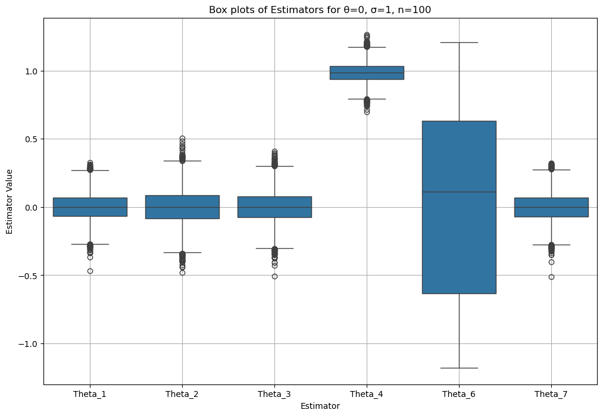

**Podsumowanie estymatorów dla $\theta$=0, $\sigma$=1, n=20** 

| estimator   |      variance |         bias |           mse |
|:------------|--------------:|-------------:|--------------:|
| Theta_1     |     0.0517449 |  0.000517699 |     0.0517451 |
| Theta_2     |     0.0740105 |  9.40662e-05 |     0.0740105 |
| Theta_3     |     0.0724033 |  0.00105446  |     0.0724044 |
| Theta_4     |     0.0231738 |  0.932169    |     0.892113  |
| Theta_5     | 19919.2       |  1.38209     | 19921.1       |
| Theta_6     |     0.688186  | -0.00143511  |     0.688188  |
| Theta_7     |     0.0542978 |  0.00121827  |     0.0542993 |

**Podsumowanie estymatorów dla $\theta$=0, $\sigma$=1, n=100** 

| estimator   |      variance |        bias |           mse |
|:------------|--------------:|------------:|--------------:|
| Theta_1     |    0.00999276 | 0.000135296 |    0.00999278 |
| Theta_2     |    0.0154535  | 0.0012887   |    0.0154552  |
| Theta_3     |    0.0128797  | 0.000334447 |    0.0128798  |
| Theta_4     |    0.00492035 | 0.984749    |    0.974651   |
| Theta_5     | 2072.9        | 0.0530262   | 2072.9        |
| Theta_6     |    0.418277   | 0.00139903  |    0.418279   |
| Theta_7     |    0.0105974  | 0.000187811 |    0.0105974  |

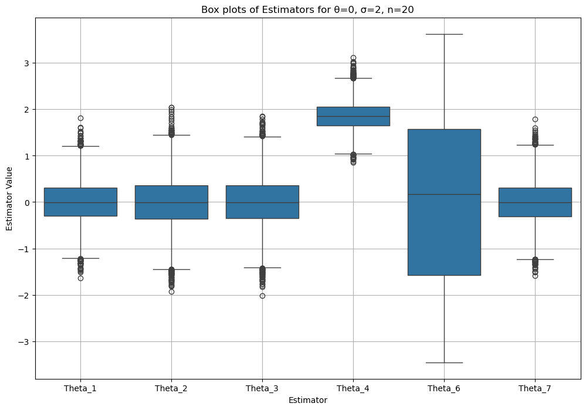

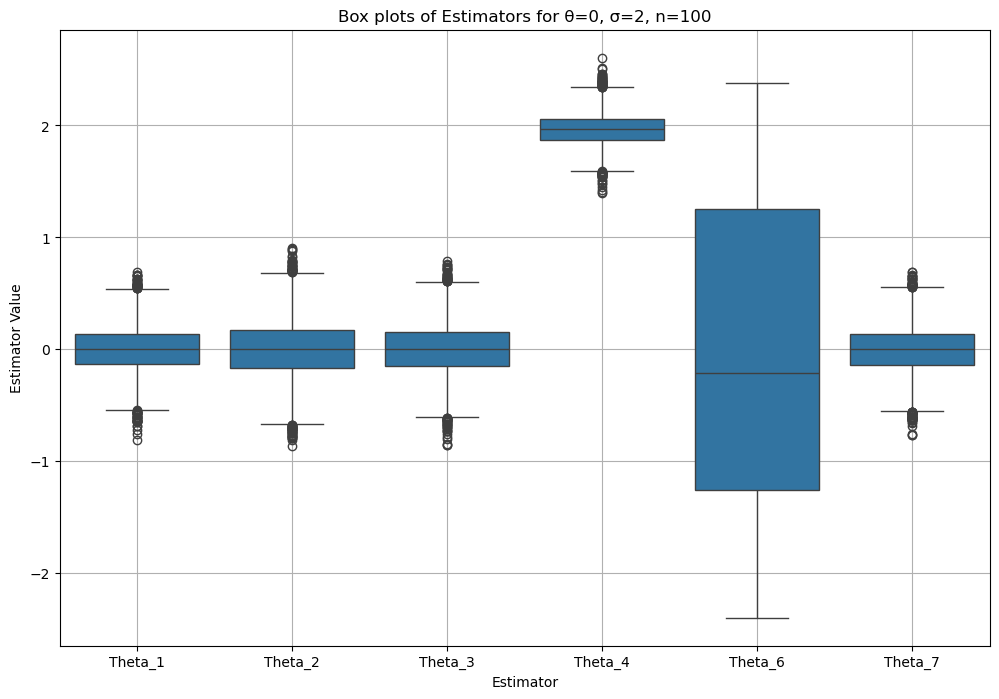

**Podsumowanie estymatorów dla $\theta$=0, $\sigma$=2, n=20** 

| estimator   |     variance |         bias |         mse |
|:------------|-------------:|-------------:|------------:|
| Theta_1     |    0.196514  |  0.000282067 |    0.196514 |
| Theta_2     |    0.290236  | -0.00266947  |    0.290243 |
| Theta_3     |    0.280163  | -0.00162155  |    0.280165 |
| Theta_4     |    0.0931464 |  1.85907     |    3.54927  |
| Theta_5     | 9515.32      |  1.35746     | 9517.16     |
| Theta_6     |    2.71751   |  0.00119541  |    2.71752  |
| Theta_7     |    0.206057  | -0.000366422 |    0.206057 |

**Podsumowanie estymatorów dla $\theta$=0, $\sigma$=2, n=100** 

| estimator   |      variance |         bias |           mse |
|:------------|--------------:|-------------:|--------------:|
| Theta_1     |     0.0403461 |  5.54498e-05 |     0.0403461 |
| Theta_2     |     0.0617297 |  0.00126558  |     0.0617313 |
| Theta_3     |     0.0516364 | -0.000564101 |     0.0516367 |
| Theta_4     |     0.0194678 |  1.96807     |     3.89275   |
| Theta_5     | 10759.4       | -1.21132     | 10760.9       |
| Theta_6     |     1.68096   | -0.00558785  |     1.68099   |
| Theta_7     |     0.0423343 |  0.000475587 |     0.0423346 |

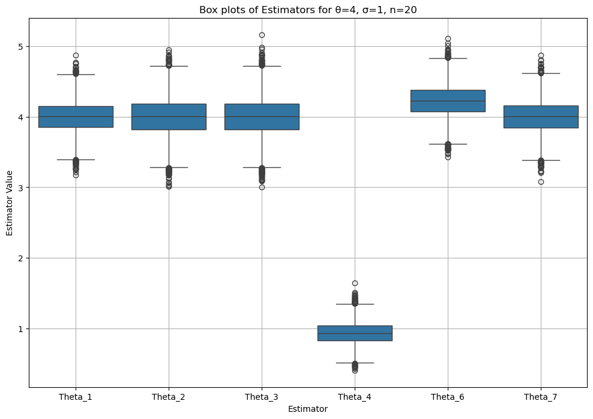

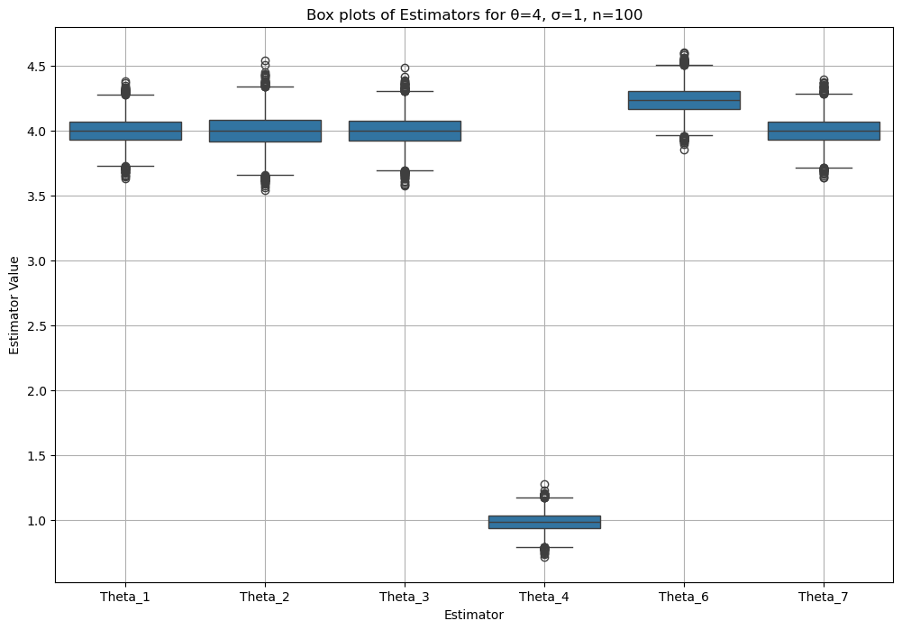

**Podsumowanie estymatorów dla $\theta$=4, $\sigma$=1, n=20** 

| estimator   |   variance |         bias |        mse |
|:------------|-----------:|-------------:|-----------:|
| Theta_1     |  0.0500678 | -0.000281489 |  0.0500679 |
| Theta_2     |  0.0727258 | -0.000626701 |  0.0727261 |
| Theta_3     |  0.071109  |  0.000234418 |  0.071109  |
| Theta_4     |  0.0227986 | -3.06635     |  9.4253    |
| Theta_5     | 10.2407    | -0.31209     | 10.3381    |
| Theta_6     |  0.0499643 |  0.224596    |  0.100408  |
| Theta_7     |  0.0526963 | -0.000258998 |  0.0526964 |

**Podsumowanie estymatorów dla $\theta$=4, $\sigma$=1, n=100** 

| estimator   |   variance |         bias |       mse |
|:------------|-----------:|-------------:|----------:|
| Theta_1     | 0.0102772  |  0.000486301 | 0.0102775 |
| Theta_2     | 0.015595   |  8.05112e-05 | 0.015595  |
| Theta_3     | 0.0130003  | -0.000256939 | 0.0130004 |
| Theta_4     | 0.00491483 | -3.01503     | 9.09535   |
| Theta_5     | 0.296166   | -0.298597    | 0.385326  |
| Theta_6     | 0.0102639  |  0.234015    | 0.0650268 |
| Theta_7     | 0.0108694  |  0.000293129 | 0.0108695 |

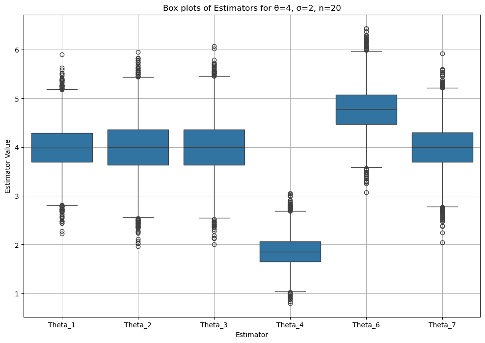

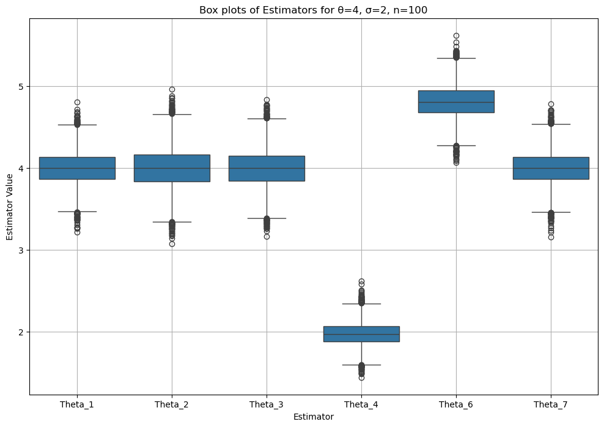

**Podsumowanie estymatorów dla $\theta$=4, $\sigma$=2, n=20** 

| estimator   |    variance |        bias |         mse |
|:------------|------------:|------------:|------------:|
| Theta_1     |    0.195642 | -0.00195183 |    0.195646 |
| Theta_2     |    0.289186 | -0.00172764 |    0.289189 |
| Theta_3     |    0.282903 |  0.00252749 |    0.282909 |
| Theta_4     |    0.094582 | -2.13792    |    4.66527  |
| Theta_5     | 5104.41     | -0.604656   | 5104.78     |
| Theta_6     |    0.196227 |  0.777175   |    0.800229 |
| Theta_7     |    0.205736 | -0.00221078 |    0.205741 |

**Podsumowanie estymatorów dla $\theta$=4, $\sigma$=2, n=100** 

| estimator   |     variance |        bias |          mse |
|:------------|-------------:|------------:|-------------:|
| Theta_1     |    0.0390363 | -0.00300797 |    0.0390454 |
| Theta_2     |    0.0601778 | -0.00178989 |    0.060181  |
| Theta_3     |    0.0499667 | -0.00222106 |    0.0499716 |
| Theta_4     |    0.019882  | -2.02932    |    4.13802   |
| Theta_5     | 1798.87      | -0.627797   | 1799.26      |
| Theta_6     |    0.0392375 |  0.80956    |    0.694626  |
| Theta_7     |    0.0413446 | -0.00216081 |    0.0413493 |

**Komentarz:**
Wraz ze wzrostem $n$, charakterystyki poprawiają się dla dobrych estymatorów. Dla złych estymatorów, co nie zmienia faktu, że pozostają one wyraźnie złe.

## Zadanie 2
**Wykresy pudełkowe estymatorów dla rozkładów $N(\theta, \sigma^2)$, $Logist(\theta, \sigma^2)$, $Cauchy(\theta, \sigma^2)$**

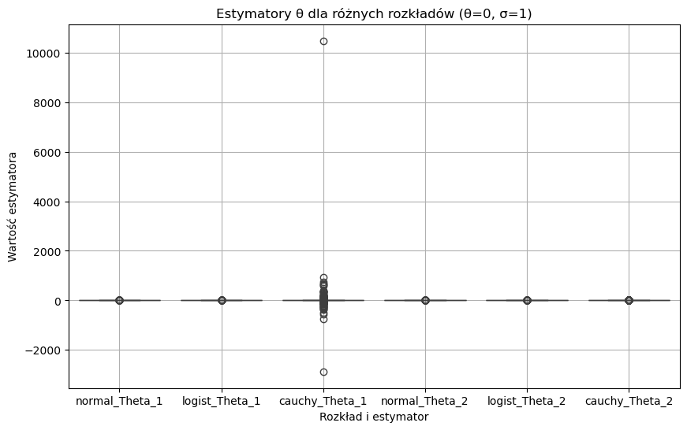
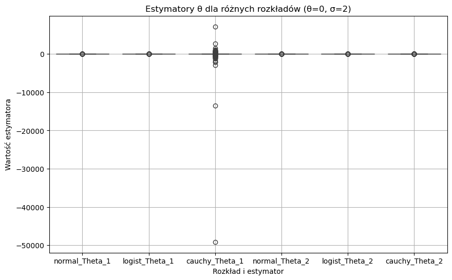
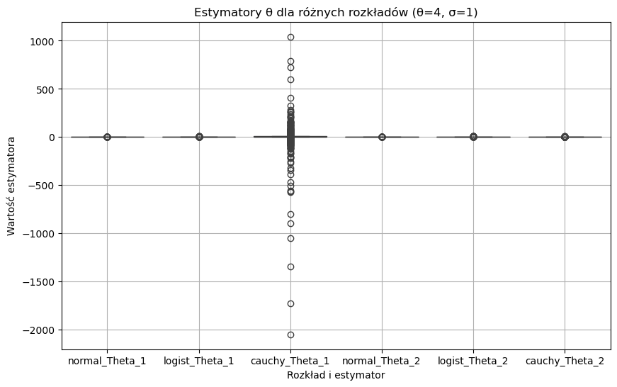
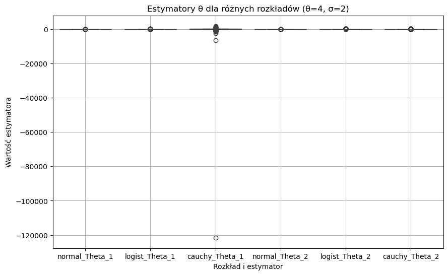

**Komentarz:**
Wykresy są mało czytelne, ponieważ estymator $\hat\theta_1$ (średnia) dla rozkładu Cauchy'ego nie jest dobrym estymatorem. Jest tak, ponieważ rozkład Cauchy'ego nie ma skończonej wartości oczekiwanej. Średnia z próby może być przesunięta przez pojedyncze wartości leżące daleko od położenia rozkładu. Widać to na wykresie. Z tego powodu na kolejnych wykresach pomijam ten estymator.

**Wykresy pudełkowe bez $\theta_1$ dla rozkładu Cauchy'ego**

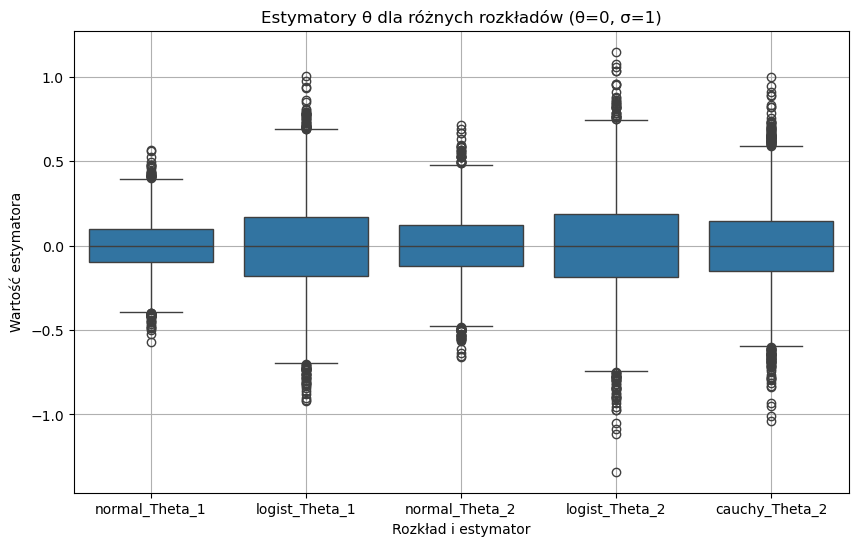

**Podsumowanie estymatorów dla $\theta$=0, $\sigma$=1**

| Distribution   | Estimator   |         Bias |     Variance |          MSE |
|:---------------|:------------|-------------:|-------------:|-------------:|
| cauchy         | Theta_1     |  1.00762     | 9854.84      | 9855.86      |
| cauchy         | Theta_2     |  0.000954526 |    0.0528114 |    0.0528123 |
| logist         | Theta_1     | -0.000669939 |    0.0647091 |    0.0647096 |
| logist         | Theta_2     | -0.00148213  |    0.0787596 |    0.0787618 |
| normal         | Theta_1     | -0.00244808  |    0.0198358 |    0.0198418 |
| normal         | Theta_2     | -0.00176751  |    0.0306577 |    0.0306608 |

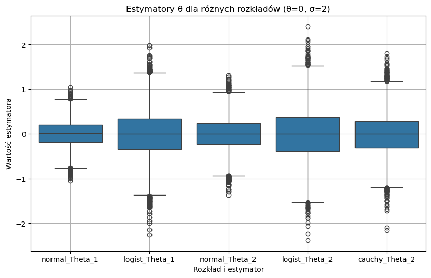

**Podsumowanie estymatorów dla $\theta$=0, $\sigma$=2**

| Distribution   | Estimator   |        Bias |       Variance |            MSE |
|:---------------|:------------|------------:|---------------:|---------------:|
| cauchy         | Theta_1     | -6.28273    | 269833         | 269872         |
| cauchy         | Theta_2     | -0.00853955 |      0.203015  |      0.203088  |
| logist         | Theta_1     | -0.00140494 |      0.265433  |      0.265435  |
| logist         | Theta_2     | -0.00111727 |      0.31974   |      0.319741  |
| normal         | Theta_1     |  0.00395633 |      0.0798637 |      0.0798793 |
| normal         | Theta_2     |  0.00403306 |      0.122367  |      0.122383  |

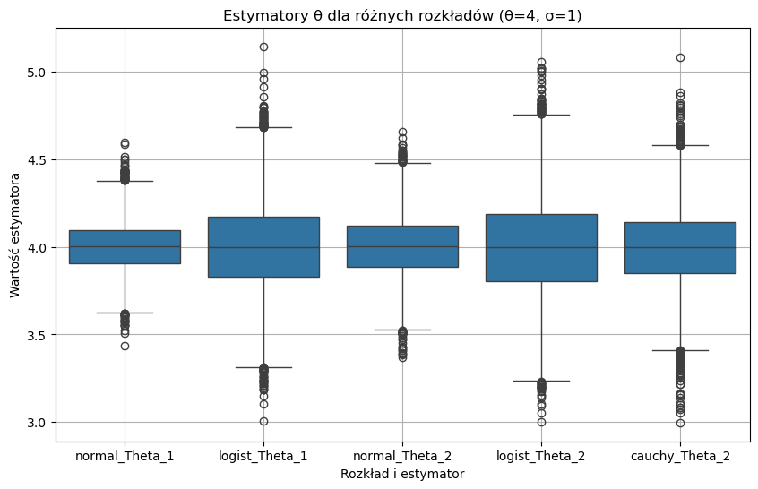

**Podsumowanie estymatorów dla $\theta$=4, $\sigma$=1**

| Distribution   | Estimator   |        Bias |     Variance |          MSE |
|:---------------|:------------|------------:|-------------:|-------------:|
| cauchy         | Theta_1     | -0.512352   | 1834.97      | 1835.23      |
| cauchy         | Theta_2     | -0.0036391  |    0.0507204 |    0.0507337 |
| logist         | Theta_1     | -0.00312843 |    0.0664254 |    0.0664352 |
| logist         | Theta_2     | -0.00237612 |    0.0803025 |    0.0803082 |
| normal         | Theta_1     |  0.00256483 |    0.0199143 |    0.0199209 |
| normal         | Theta_2     |  0.00328088 |    0.0306682 |    0.0306789 |

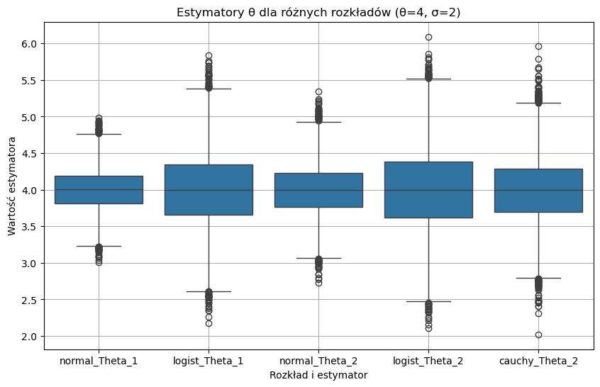

**Podsumowanie estymatorów dla $\theta$=4, $\sigma$=2**

| Distribution   | Estimator   |          Bias |    Variance |         MSE |
|:---------------|:------------|--------------:|------------:|------------:|
| cauchy         | Theta_1     | -14.0043      | 1.48413e+06 | 1.48432e+06 |
| cauchy         | Theta_2     |  -0.00246518  | 0.205415    | 0.205422    |
| logist         | Theta_1     |   0.00137745  | 0.261095    | 0.261097    |
| logist         | Theta_2     |  -2.09628e-05 | 0.312594    | 0.312594    |
| normal         | Theta_1     |  -0.00103192  | 0.0800178   | 0.0800189   |
| normal         | Theta_2     |  -0.00102479  | 0.121482    | 0.121483    |

**Komentarz:**

- Cauchy: Średnia nie jest sensownym estymatorem, natomiast mediana jest nieobciążona.

- Logist: Oba estymatory są nieobciążone, natomiast średnia jest bardziej efektywna.

- Normal: Tutaj również oba estymatory są nieobciążone i średnia jest bardziej efektywna od mediany.

- Wariancje dla estymatorów w rozkładzie Logist i Cauchy są większe, ponieważ te rozkłady mają cięższe ogony niż rozkład normalny.

# Zadanie 3

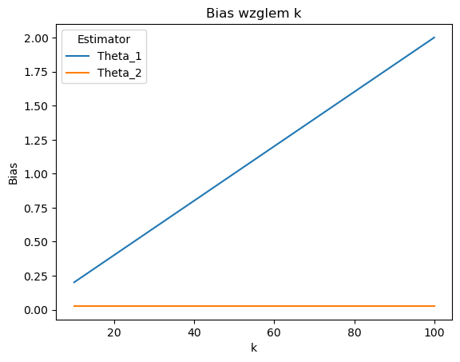
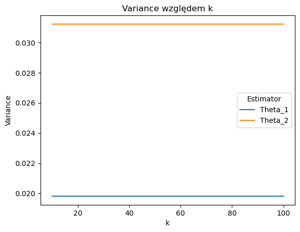
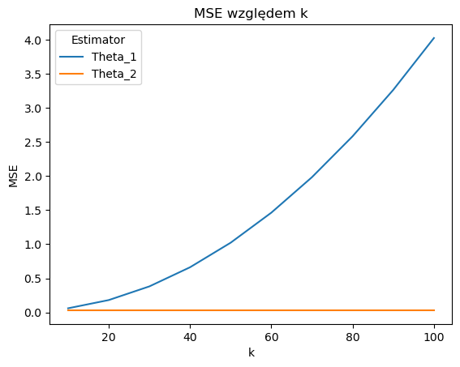

**podsumowanie estymatorów**

|   k | Estimator   |      Bias |   Variance |       MSE |
|----:|:------------|----------:|-----------:|----------:|
|  10 | Theta_1     | 0.20049   |  0.0195556 | 0.059752  |
|  10 | Theta_2     | 0.0239111 |  0.0318637 | 0.0324354 |
|  20 | Theta_1     | 0.40049   |  0.0195556 | 0.179948  |
|  20 | Theta_2     | 0.0239111 |  0.0318637 | 0.0324354 |
|  30 | Theta_1     | 0.60049   |  0.0195556 | 0.380144  |
|  30 | Theta_2     | 0.0239111 |  0.0318637 | 0.0324354 |
|  40 | Theta_1     | 0.80049   |  0.0195556 | 0.66034   |
|  40 | Theta_2     | 0.0239111 |  0.0318637 | 0.0324354 |
|  50 | Theta_1     | 1.00049   |  0.0195556 | 1.02054   |
|  50 | Theta_2     | 0.0239111 |  0.0318637 | 0.0324354 |
|  60 | Theta_1     | 1.20049   |  0.0195556 | 1.46073   |
|  60 | Theta_2     | 0.0239111 |  0.0318637 | 0.0324354 |
|  70 | Theta_1     | 1.40049   |  0.0195556 | 1.98093   |
|  70 | Theta_2     | 0.0239111 |  0.0318637 | 0.0324354 |
|  80 | Theta_1     | 1.60049   |  0.0195556 | 2.58113   |
|  80 | Theta_2     | 0.0239111 |  0.0318637 | 0.0324354 |
|  90 | Theta_1     | 1.80049   |  0.0195556 | 3.26132   |
|  90 | Theta_2     | 0.0239111 |  0.0318637 | 0.0324354 |
| 100 | Theta_1     | 2.00049   |  0.0195556 | 4.02152   |
| 100 | Theta_2     | 0.0239111 |  0.0318637 | 0.0324354 |

**Komentarz:**

- Bias rośnie liniowo dla średniej. Dodanie jednej dużej wartości do próbki powoduje, że średnia rośnie w jej kierunku. Dla mediany bias nie rośnie, ponieważ mediana jest odporna na tę jedną odstającą wartość.

- Wariancja jest stała, ponieważ k to stała, więc nie wpływa na wariancję.

- MSE to $bias^2 + var$, więc dla średniej rośnie kwadratowo a dla mediany nie zależy od k.

# Zadanie 4

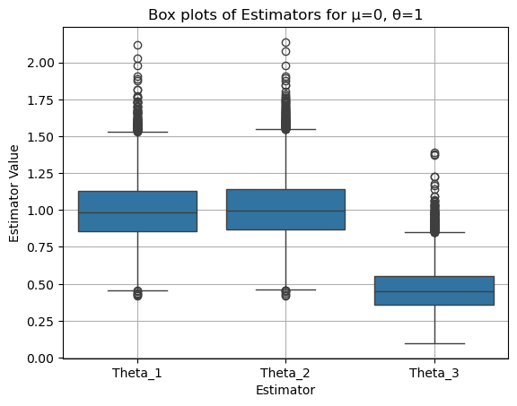

**Podsumowanie estymatorów $\mu$=0, $\theta$=1** 

| estimator   |   variance |        bias |       mse |
|:------------|-----------:|------------:|----------:|
| Theta_1     |  0.0413177 |  0.00089363 | 0.0413185 |
| Theta_2     |  0.0424278 |  0.0115404  | 0.042561  |
| Theta_3     |  0.0225959 | -0.535584   | 0.309446  |

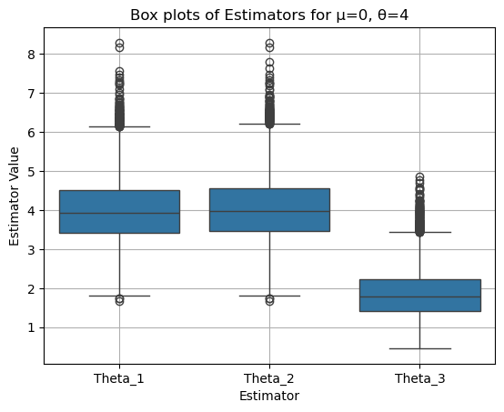

**Podsumowanie estymatorów $\mu$=0, $\theta$=4** 

| estimator   |   variance |        bias |      mse |
|:------------|-----------:|------------:|---------:|
| Theta_1     |   0.655936 | -0.00403593 | 0.655952 |
| Theta_2     |   0.675235 |  0.0402511  | 0.676855 |
| Theta_3     |   0.36753  | -2.14418    | 4.96506  |

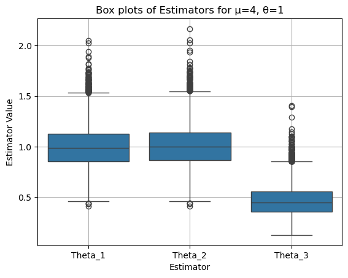

**Podsumowanie estymatorów $\mu$=4, $\theta$=1** 

| estimator   |   variance |        bias |       mse |
|:------------|-----------:|------------:|----------:|
| Theta_1     |  0.0414645 | -0.0021624  | 0.0414691 |
| Theta_2     |  0.04264   |  0.00877086 | 0.0427169 |
| Theta_3     |  0.0226316 | -0.536303   | 0.310252  |

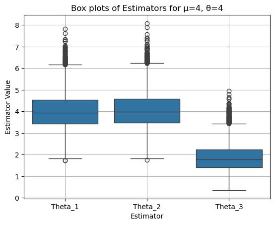

**Podsumowanie estymatorów $\mu$=4, $\theta$=4** 

| estimator   |   variance |        bias |      mse |
|:------------|-----------:|------------:|---------:|
| Theta_1     |   0.651435 |  0.00536937 | 0.651464 |
| Theta_2     |   0.67091  |  0.0481571  | 0.673229 |
| Theta_3     |   0.361556 | -2.14499    | 4.96255  |

**Komentarz:**

- $\hat\theta_1$ jest najlepszym z rozważanych estymatorów. Jest nieobciążony i ma najmniejszy mse.

- $\hat\theta_2$ jest słabszym estymatorem niż $\theta_1$ ale nadal ma dobre charakterystyki.

- $\hat\theta_3$ nie jest dobrym estymatorem. Znacząco wyróżnia się na tle reszty. Jest silnie zaniżony. Ma małą wariancję, natomiast nie jest to istotna zaleta patrząc na bias i mse.

- Wszystkie estymatory są nieczułe na zmianę parametru $\mu$, co jest plusem.