# Raport z listy 2

Jakub Kowalczyk

---

Oznaczenia przyjmuję analogiczne do treści zadań. W wykresach stosuję często 'Theta_hat' zamiast $\hat{\theta}$.

Do porównania estymatorów stosuje wykresy zgodnie z treścią zadań oraz charakterystyki:

- $bias(\hat{\theta}) = E\hat{\theta} - \theta$

- $var(\hat{\theta}) = E(\hat{\theta} - E\hat{\theta})^2$

- $MSE(\hat{\theta}) = E(\hat{\theta} - \theta)^2 = bias^2(\hat{\theta}) + var(\hat{\theta})$

## Zadanie 1

$\hat{\theta}$ to estymator największej wiarogodności wielkości $P(X \ge 3)$,
gdzie $X ~ Binom(5, p)$.

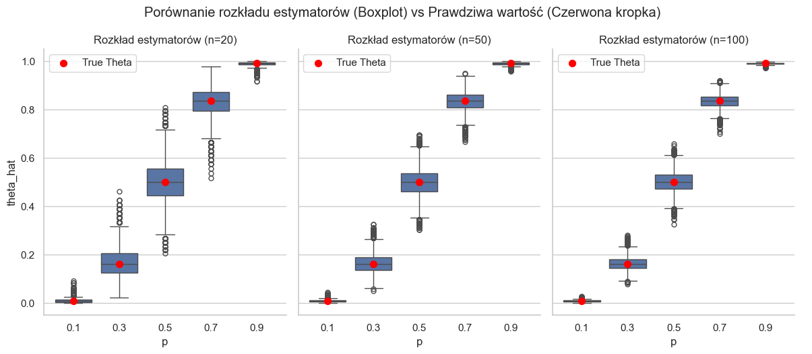
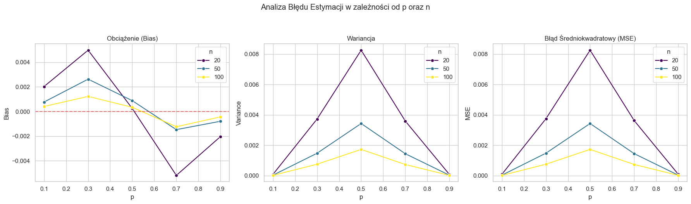

**Komentarz:**

- mediany boxplotów pokrywają się niemal idealnie z czerwonymi kropkami (prawdziwymi wartościami $\theta$). Oznacza to, że estymator jest asymptotycznie nieobciążony. Widać to tez na wykresie $Bias$

- Szerokość pudełek maleje wraz ze wzrostem n, co jest spodziewane. Im większa próbka tym dokładniej estymujemy $\theta$. Analogicznie charakterystyki estymatorów są lepsze dla większych $n$.

- Wariancja jest najmniejsza dla skrajnych $p$ ($0.1$, $0.9$), ponieważ tam zdarzenie $X \ge 3$ jest albo bardzo rzadkie, albo prawie pewne, więc zmienność próby mało wpływa na wynik.

- W $MSE$ dominuje składnik wariancji, dlatego wykres jest bardzo podobny.

## Zadanie 2

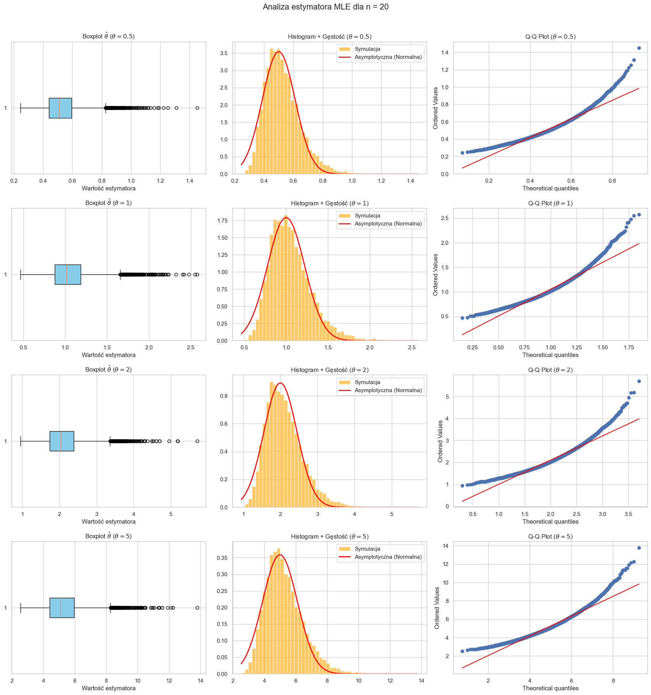

\newpage

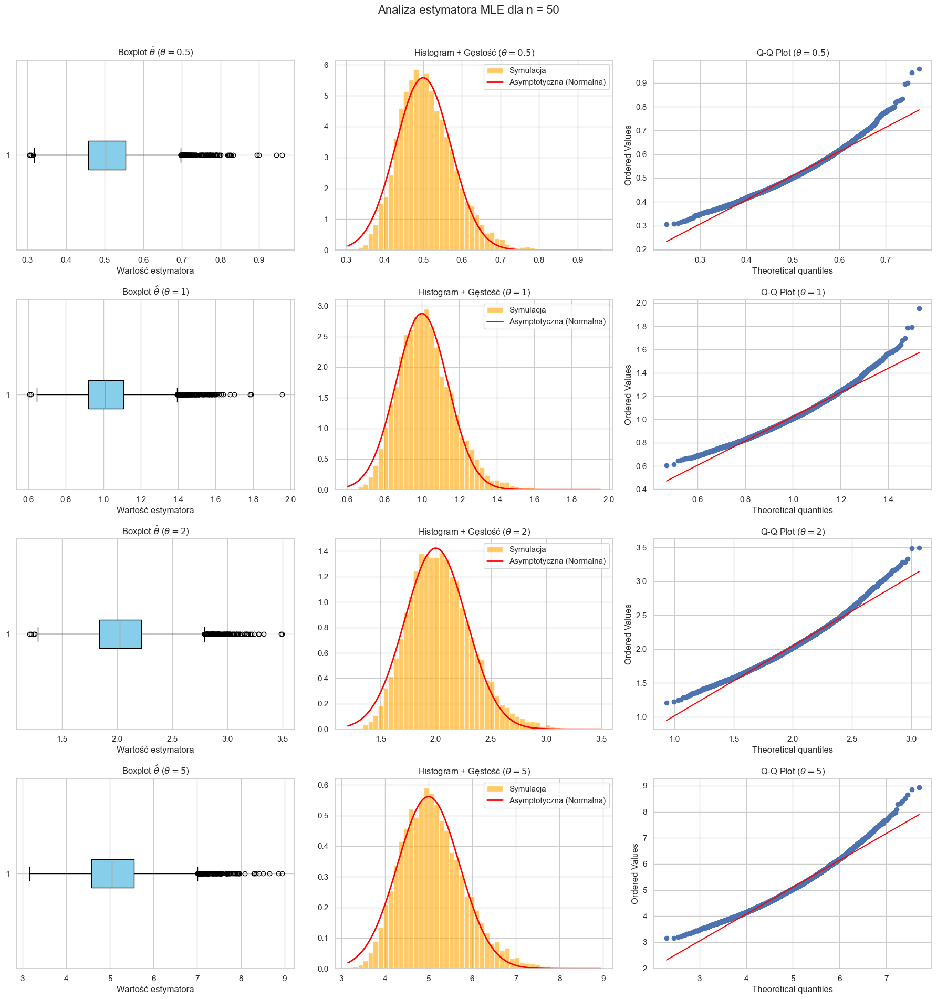

\newpage

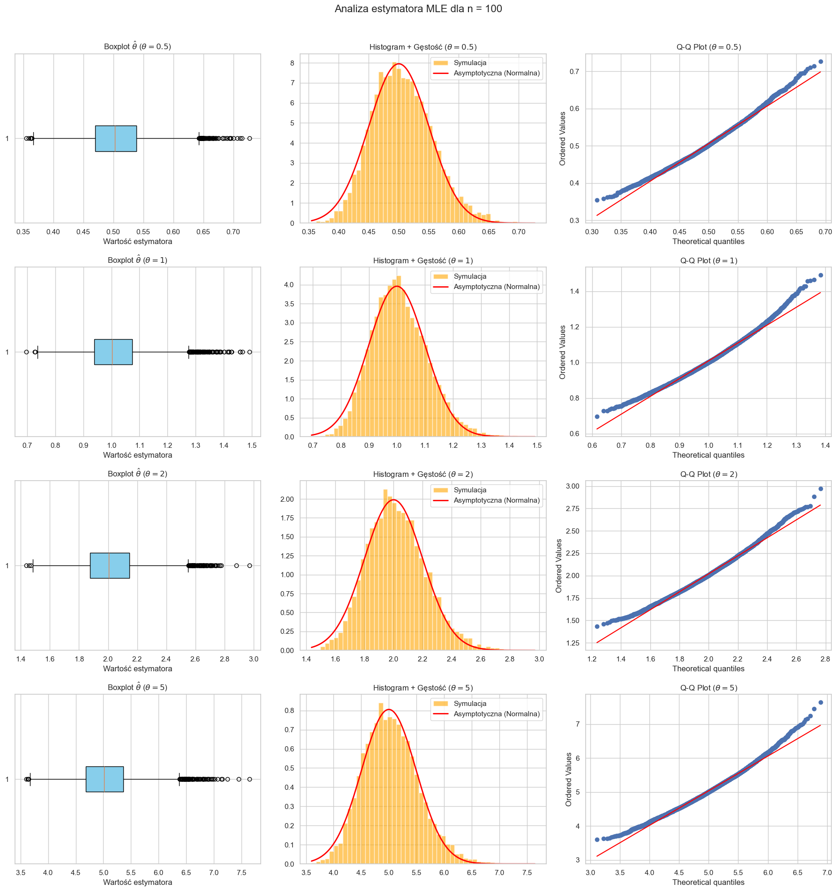

**komentarz**

- rozkład zmiennej losowej $\hat\theta$ nie jest idealnie normalny. Widać na wykresach, że estymator ma tendencję do przeszacowywania wartości. Widać to zwłaszcza dla małych n.

- Estymator jest asymptotycznie normalny co widać na wykresach przez zbliżanie się do prostej na wykresie q-q wraz ze wzrostem n.

## Zadanie 3

### Część 1. - Wybór punktu startowego
Do wyznaczenia rozwiązania wykorzystuję funkcję biblioteczną scipy.optimize.minimize (minimalizuję funkcję negative log likelihood). Funkcja jest bardzo odporna na wybór punktu startowego, choć lepszy start (np. średnia) nadal może zmniejszyć liczbę iteracji.

Wyniki przedstawiam w tabelce, gdzie ostatni wiersz to właśnie średnia. Obliczenia były wykonywane dla $n=50$, $\theta=4$, $\sigma=2$

| Punkt startowy | Estymator | Iteracje |
|----------------|-----------|----------|
|           0.00 | 4.1569 | 5 |
|           4.00 | 4.1569 | 2 |
|          10.00 | 4.1569 | 6 |
|         -20.00 | 4.1569 | 5 |
|           4.16 | 4.1569 | 1 |

Kolejne eksperymenty wykonuję już z punktem startowym równym średniej.

### Część 2. - Estymator największej wiarygodności

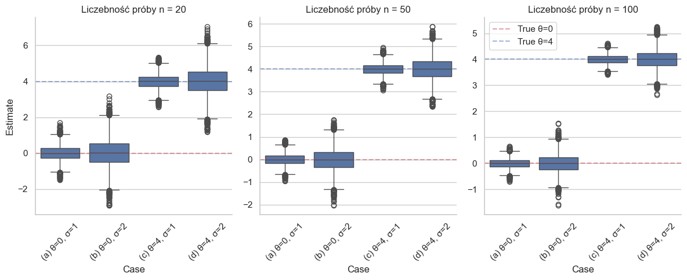

#### Charakterystyki
|   N | Case         |    Bias |   Variance |    MSE |
|----:|:-------------|--------:|-----------:|-------:|
|  20 | (a) $\theta$=0, $\sigma$=1 |  0.0037 |     0.1528 | 0.1528 |
|  20 | (b) $\theta$=0, $\sigma$=2 |  0.0196 |     0.6014 | 0.6018 |
|  20 | (c) $\theta$=4, $\sigma$=1 |  0.0007 |     0.1499 | 0.1499 |
|  20 | (d) $\theta$=4, $\sigma$=2 |  0.0132 |     0.6142 | 0.6144 |
|  50 | (a) $\theta$=0, $\sigma$=1 | -0.0005 |     0.0612 | 0.0612 |
|  50 | (b) $\theta$=0, $\sigma$=2 | -0.0079 |     0.2433 | 0.2434 |
|  50 | (c) $\theta$=4, $\sigma$=1 | -0.0001 |     0.0607 | 0.0607 |
|  50 | (d) $\theta$=4, $\sigma$=2 |  0.0027 |     0.242  | 0.242  |
| 100 | (a) $\theta$=0, $\sigma$=1 |  0.0003 |     0.031  | 0.031  |
| 100 | (b) $\theta$=0, $\sigma$=2 | -0.0017 |     0.1225 | 0.1225 |
| 100 | (c) $\theta$=4, $\sigma$=1 |  0.0016 |     0.0296 | 0.0296 |
| 100 | (d) $\theta$=4, $\sigma$=2 |  0.0011 |     0.1235 | 0.1235 |

**Komentarz:**

- Estymator jest asymptotycznie nieobciążony (Bias jest bliski $0$ i maleje ze wzrostem $n$)

- Wariancja ma znaczący wpływ na precyzję estymatora, co widać po szerokości pudełek na wykresach.

## Zadanie 4

### pkt a)
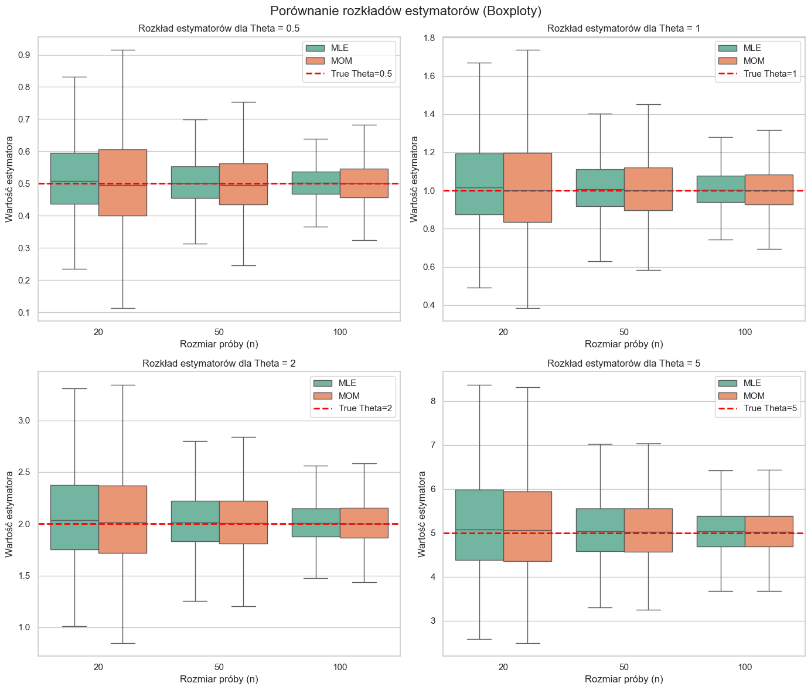
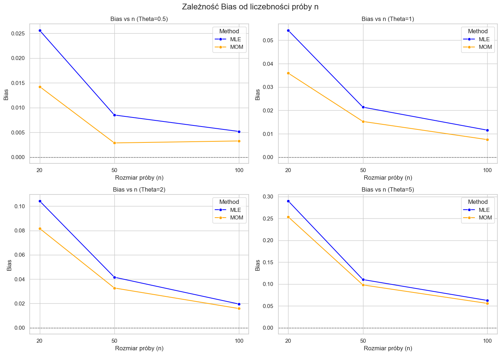
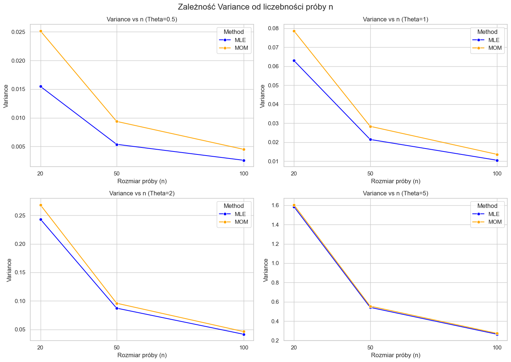
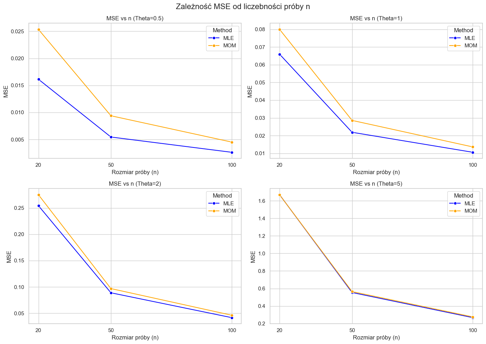

**Komentarz:**

- Estymator MLE ma mniejszą wariancję zwłaszcza dla małych n, co oznacza, że jest bardziej efektywny.

- Oba estymatory są asymptotycznie nieobciążone (ich bias maleje wraz ze wzrostem n)

### pkt b)
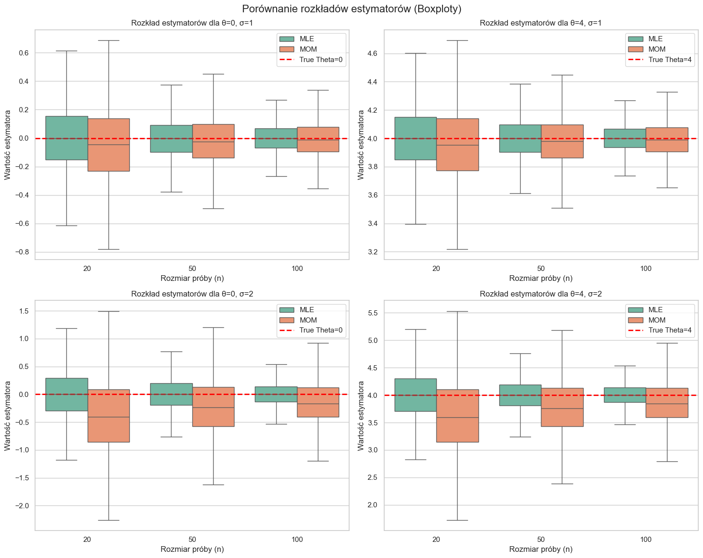
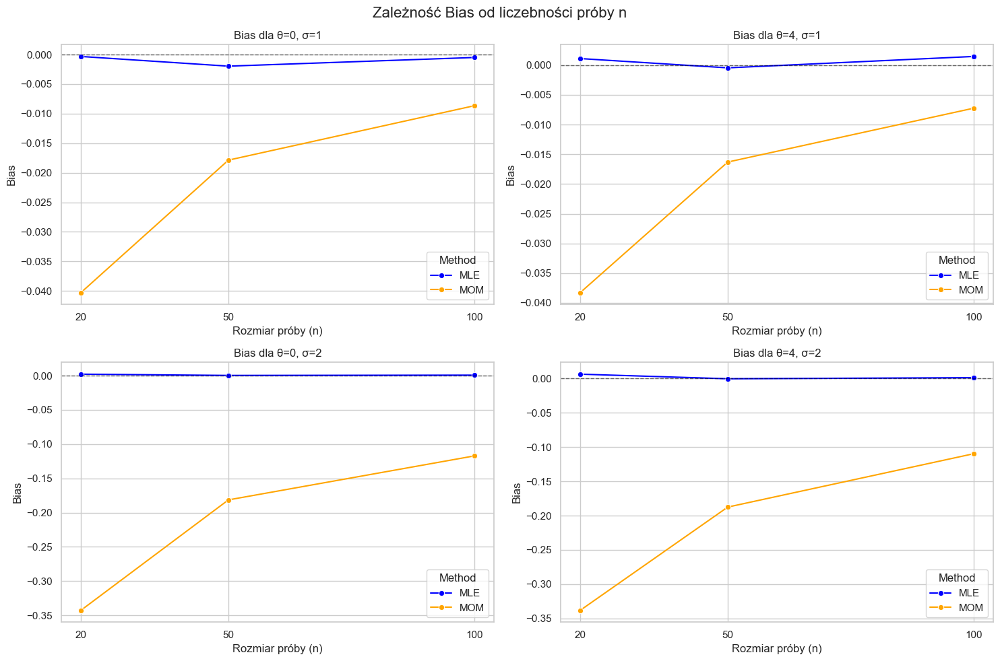
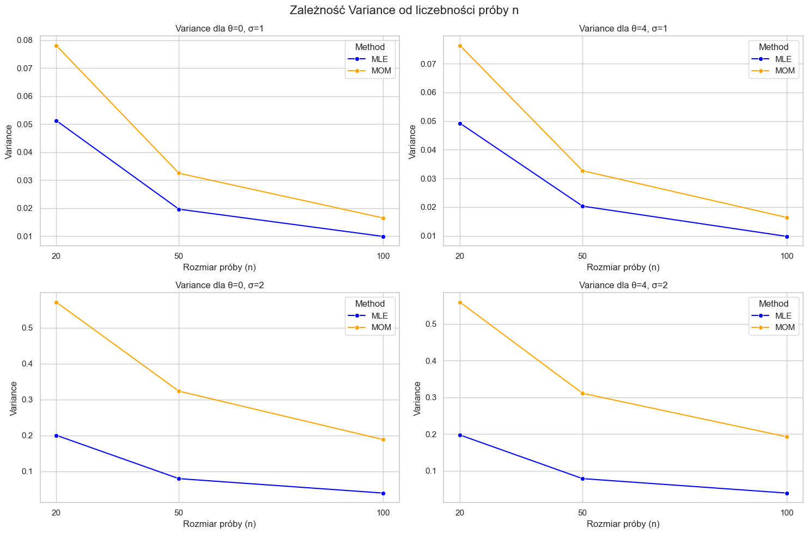
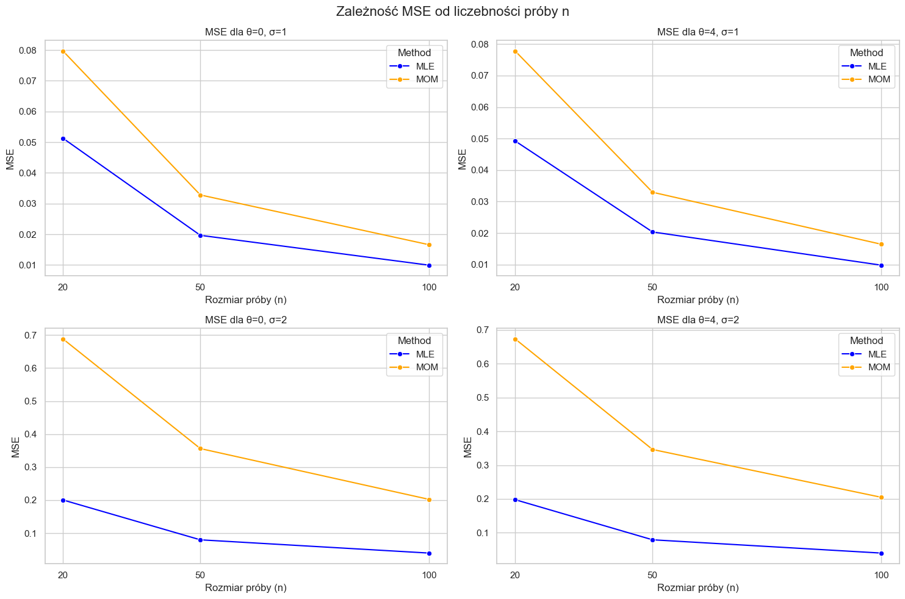

**Komentarz:**

- MLE jest lepszym estymatorem. Ma wyraźnie mniejszą wariancję, bias i MSE

- MLE jest estymatorem nieobciążonym, natomiast bias MOM jest daleki od 0, chociaż maleje wraz ze zwrostem n. MOM systematycznie zaniża wartość parametru $\theta$.