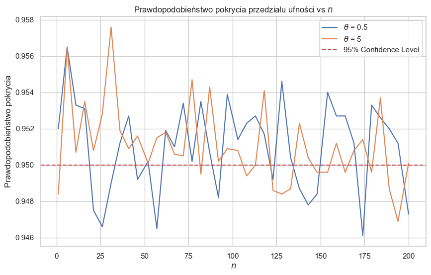
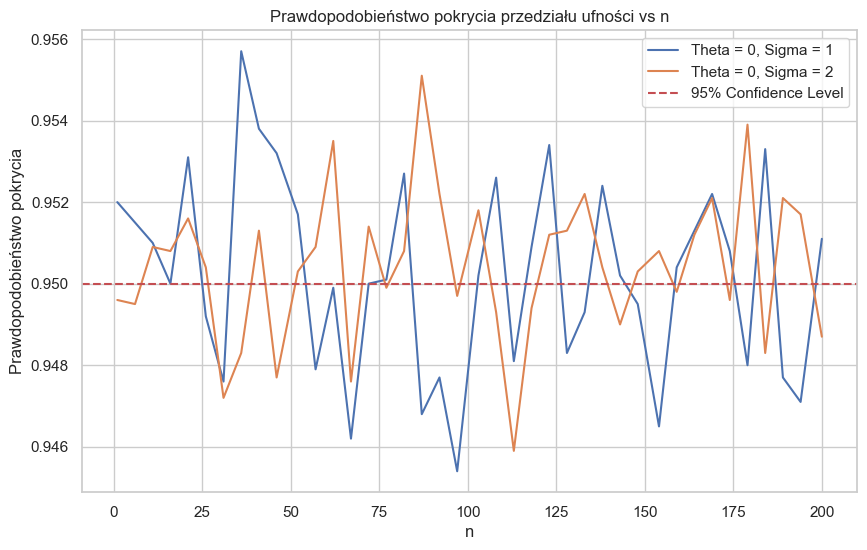
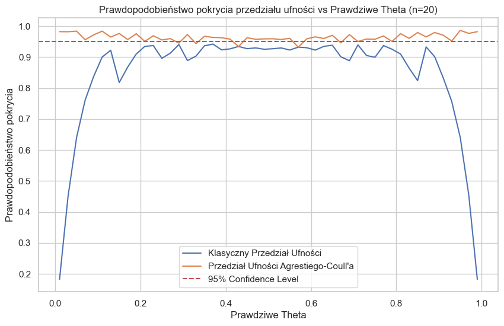
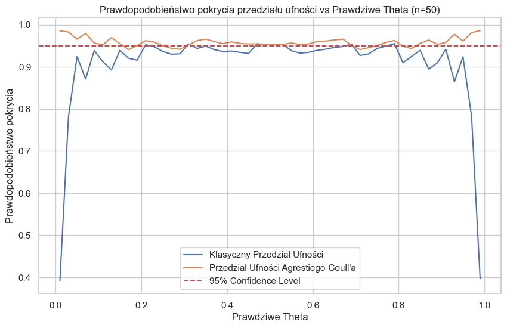
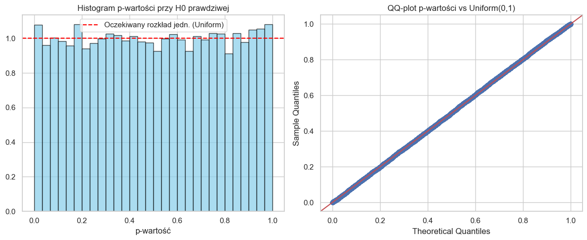
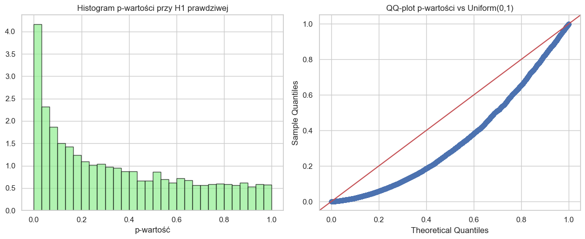
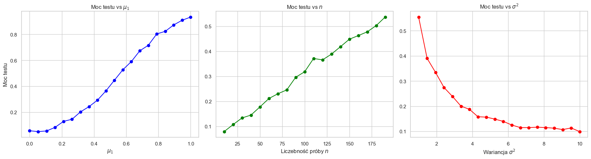

# Raport z listy 3

Jakub Kowalczyk

## Zadanie 1

**1. Pokrycie dla wartości oczekiwanej (Znana Wariancja)**

| Rozkład       |     20 |     50 |    100 |
|:--------------|-------:|-------:|-------:|
| Laplace (a)   | 0.9495 | 0.9466 | 0.9493 |
| Laplace (b)   | 0.9449 | 0.9506 | 0.9531 |
| Logistic (a)  | 0.9472 | 0.9501 | 0.9481 |
| Logistic (b)  | 0.9494 | 0.9492 | 0.9549 |
| Normal (a)    | 0.9488 | 0.9500 | 0.9486 |
| Normal (b)    | 0.9489 | 0.9486 | 0.9488 |
| Student-t (a) | 0.9547 | 0.9536 | 0.9523 |
| Student-t (b) | 0.9523 | 0.9520 | 0.9517 |
| Student-t (c) | 0.9509 | 0.9500 | 0.9476 |

**2. Pokrycie dla wartości oczekiwanej (Nieznana Wariancja)**

| Rozkład       |     20 |     50 |    100 |
|:--------------|-------:|-------:|-------:|
| Laplace (a)   | 0.9519 | 0.9473 | 0.9469 |
| Laplace (b)   | 0.9512 | 0.9479 | 0.9535 |
| Logistic (a)  | 0.9508 | 0.9510 | 0.9474 |
| Logistic (b)  | 0.9502 | 0.9510 | 0.9546 |
| Normal (a)    | 0.9468 | 0.9504 | 0.9506 |
| Normal (b)    | 0.9490 | 0.9456 | 0.9503 |
| Student-t (a) | 0.9601 | 0.9531 | 0.9506 |
| Student-t (b) | 0.9531 | 0.9534 | 0.9526 |
| Student-t (c) | 0.9484 | 0.9490 | 0.9495 |

**3. Pokrycie dla wariancji**

| Rozkład       |     20 |     50 |    100 |
|:--------------|-------:|-------:|-------:|
| Laplace (a)   | 0.8204 | 0.7967 | 0.7904 |
| Laplace (b)   | 0.8201 | 0.8006 | 0.7896 |
| Logistic (a)  | 0.8984 | 0.8956 | 0.8787 |
| Logistic (b)  | 0.8941 | 0.8851 | 0.8857 |
| Normal (a)    | 0.9492 | 0.9488 | 0.9516 |
| Normal (b)    | 0.9486 | 0.9530 | 0.9489 |
| Student-t (a) | 0.6661 | 0.5660 | 0.4947 |
| Student-t (b) | 0.9076 | 0.8993 | 0.8956 |
| Student-t (c) | 0.9316 | 0.9297 | 0.9295 |

**Komentarz:**

- Estymacja przedziałowa średniej jest odporna na naruszenie założenia o normalności rozkładu. Mimo że generowaliśmy dane z rozkładów innych niż normalny, prawdopodobieństwo pokrycia dla średniej i tak jest blisko 0.95 (dla rozkładu normalnego oczywiście też). Jest to zgodne z tym, czego spodziewamy się na podstawie CTG.

- To, czy znamy wariancję czy nie za bardzo nie wpływa na obserwowane wyniki, ponieważ nawet dla $n = 20$ próba jest już dostatecznie duża.

- Estymacja przedziałowa wariancji nie jest odporna na odstępstwa od normalności, ponieważ dla rozkładów Laplace'a, Logistycznego i t-Studenta mamy większe ogony. Z tego powodu powstają nam outliery, które wpływają znacząco na wyliczanie estymatora wariancji, co wpływa na oszacowanie prawdopodobieństwa pokrycia parametru przez przedział ufności.

## Zadanie 2

#### a)

$\beta(\theta, 1)$

#### b)

$Lognorm(\theta, \sigma)$

**Komentarz:**

- Estymatory MLE dla obu rozkładów posiadają własność asymptotycznej normalności. Dla dużych rozmiarów próby $n$, prawdopodobieństwo pokrycia 
nieznanego parametru $\theta$ przez skonstruowany przedział ufności oscyluje coraz dokładniej wokół oczekiwanego poziomu ufności $0.95$.

- Zmiana parametrów rozkładu w obu przypadkach nie wpływa na tę własność.

## Zadanie 3

**Komentarz:**

- Klasyczny przedział ufności nie radzi sobie dla prawdziwej wartości $\theta$ blisko 0 lub blisko 1. W takich wypadkach próba ma często same porażki lub same sukcesy, co powoduje, że przedział ufności jest bardzo mały. W takim wypadku prawdziwe teta często leży poza przedziałem.

- Metoda Agrestiego-Coulla dodaje sztucznie dwa sukcesy i dwie porażki. Ma to małe znaczenie w przypadku, gdzie $\theta$ nie osiąga skrajnych wartości, notomiast na końcach wykresu widać znaczną poprawę. Wynika to z faktu, że mamy mniej zdegenerowanych przypadków, gdzie otrzymujemy praktycznie same sukcesy lub praktycznie same porażki.

- Wraz ze wzrostem rozmiaru próby $n$ różnica między dwoma metodami jest coraz mniejsza, co jest spodziewane.

## Zadanie 4

#### a)

Przy pojedyńczej próbie uzyskałem p-wartość = 0.7288, a zatem mamy brak podstaw do odrzucenia $H_0$.

#### b)

P-wartości są rozłożone jednostajnie. Jeśli $H_0$ jest prawdziwa, to każda p-wartość jest tak samo prawdopodobna.

Obliczenia dla 10000 symulacji:

- Empiryczny błąd I rodzaju: 0.0491

- 95% Przedział ufności: [0.0449, 0.0533]

#### c)

Przy pojedyńczej próbie uzyskałem p-wartość = 0.0283, a zatem odrzucamy H0

#### d)

Histogram jest mocno przechylony w lewą stronę, co oznacza, że nasz test często wykrywa odstępstwo od 0.

Obliczenia dla 10000 symulacji:

- Empiryczna moc testu: 0.1812

- 95% Przedział ufności dla mocy: [0.1737, 0.1887]

#### e)

- Moc vs $\mu_1$ - Im bardziej $\mu_1$ różni się od zera, tym łatwiej wykryć to w teście, dlatego moc rośnie.

- Moc vs $n$ - Im więcej danych, tym precyzyjniej estymujemy, więc łatwiej odrzucić fałszywą hipotezę zerową, dlatego moc rośnie.

- Moc vs $\sigma^2$ - Im większy szum danych, tym trudniej zauważyć przesunięcie średniej o 0.3, dlatego moc spada.