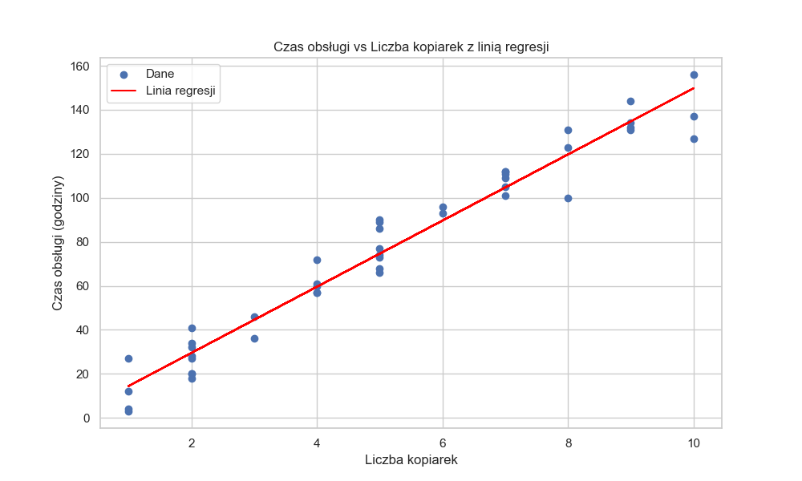
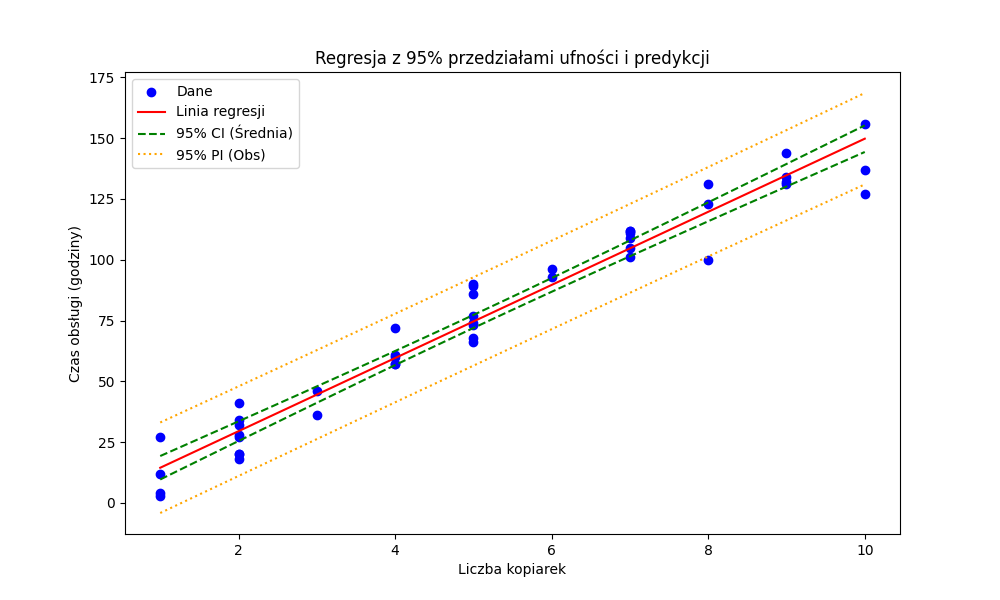
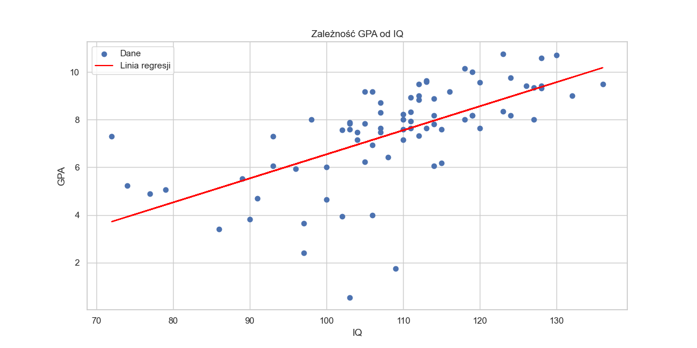
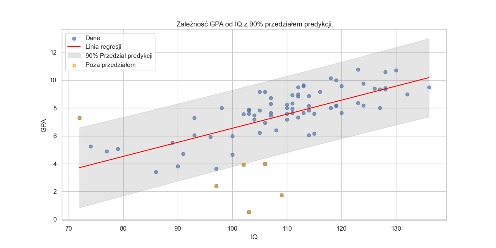
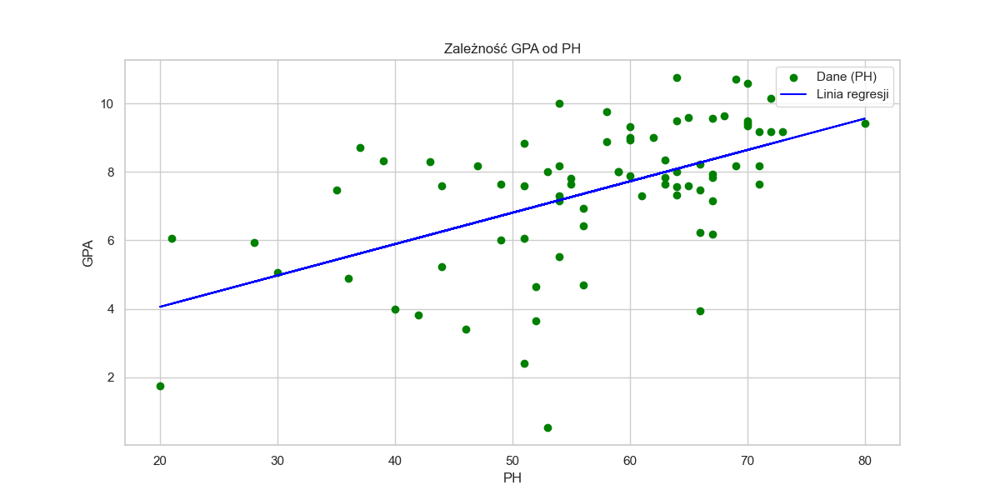

# Raport z listy 4

Jakub Kowalczyk

## Zadanie 1

W tym zadaniu analizujemy zależność czasu obsługi (*y*) od liczby obsługiwanych maszyn (*x*). Dane pochodzą z pliku `ch01pr20.txt`.

### a) Wykres i Regresja Liniowa

Na podstawie wykresu punktowego (poniżej) można stwierdzić, że zależność między czasem obsługi a liczbą kopiarek jest w przybliżeniu liniowa. Punkty układają się wzdłuż prostej, co sugeruje zasadność zastosowania modelu regresji liniowej prostej:
$$ y = \beta_0 + \beta_1 x + \epsilon $$

Obliczone parametry regresji:
- **Teoretyczne:**
  - $\beta_0 = -0.580157$
  - $\beta_1 = 15.035248$
- **Biblioteczne (`statsmodels`):**
  - $\beta_0 = -0.580157$
  - $\beta_1 = 15.035248$

Równanie regresji:
$$ y = -0.58 + 15.04 x $$

### b) 95% Przedziały Ufności dla Slope'a i Intersepta

Poniższa tabela przedstawia punktowe estymatory oraz 95% przedziały ufności dla wyrazu wolnego ($\beta_0$) i współczynnika kierunkowego ($\beta_1$). Wyniki obliczone ręcznie są zgodne z wynikami z biblioteki.

| Parametr           | Metryka   | Teoretycznie           | Biblioteka             |
|:-------------------|:----------|:-----------------------|:-----------------------|
| Intercept (Beta 0) | Estymator | -0.580157              | -0.580157              |
| Slope (Beta 1)     | Estymator | 15.035248              | 15.035248              |
| Intercept (Beta 0) | 95% CI    | (-6.234843, 5.074529)  | [-6.234843, 5.074529]  |
| Slope (Beta 1)     | 95% CI    | (14.061010, 16.009486) | [14.061010, 16.009486] |

### c) Test Istotności Parametrów

Przeprowadzono testy istotności dla obu parametrów.
Hipotezy:
- $H_0: \beta_i = 0$
- $H_1: \beta_i \neq 0$

| Parametr           | Metryka      |   Teoretycznie |   Biblioteka |
|:-------------------|:-------------|---------------:|-------------:|
| Intercept (Beta 0) | Statystyka T |      -0.206908 | -0.206908    |
| Intercept (Beta 0) | p-wartość    |       0.837059 |  0.837059    |
| Slope (Beta 1)     | Statystyka T |      31.1233   | 31.1233      |
| Slope (Beta 1)     | p-wartość    |       0        |  4.00903e-31 |

**Wnioski:**
- **Slope ($\\beta_1$):** p-wartość $\approx 0 < 0.05$. Odrzucamy $H_0$. Istnieje istotna statystycznie zależność liniowa między liczbą kopiarek a czasem obsługi. Każda dodatkowa kopiarka zwiększa oczekiwany czas obsługi o około 15 godzin.
- **Intercept ($\\beta_0$):** p-wartość $\approx 0.84 > 0.05$. Nie ma podstaw do odrzucenia $H_0$. Wyraz wolny nie różni się istotnie od zera. W kontekście zadania oznacza to, że przy zerowej liczbie maszyn czas obsługi jest bliski zeru, co jest logiczne.

### d) Przedział Ufności dla Wartości Oczekiwanej

Estymujemy średni czas obsługi dla $k$ maszyn.

|   k |   Oczekiwana (Teor) |   CI Średnia Dolna (Teor) |   CI Średnia Górna (Teor) |   Długość CI |   Oczekiwana (Bibl) |   CI Średnia Dolna (Bibl) |   CI Średnia Górna (Bibl) |
|----:|--------------------:|--------------------------:|--------------------------:|-------------:|--------------------:|--------------------------:|--------------------------:|
|   1 |             14.4551 |                   9.63614 |                   19.274  |      9.6379  |             14.4551 |                   9.63614 |                   19.274  |
|   5 |             74.5961 |                  71.9142  |                   77.2779 |      5.36372 |             74.5961 |                  71.9142  |                   77.2779 |
|   8 |            119.702  |                 115.816   |                  123.588  |      7.77223 |            119.702  |                 115.816   |                  123.588  |
|  11 |            164.808  |                 158.475   |                  171.14   |     12.6643  |            164.808  |                 158.475   |                  171.14   |
|  25 |            375.301  |                 355.74    |                  394.862  |     39.1219  |            375.301  |                 355.74    |                  394.862  |
| 100 |           1502.94   |                1410.46    |                 1595.43   |    184.966   |           1502.94   |                1410.46    |                 1595.43   |

**Wniosek:** Długość przedziału ufności zależy od odległości $k$ od średniej liczby maszyn w próbie ($\\bar{x} \approx 5.11$). Im dalej punkt $k$ znajduje się od $\\bar{x}$, tym przedział jest szerszy (większa niepewność estymacji średniej). Najwęższy przedział obserwujemy dla $k=5$, które jest najbliżej średniej.

### e) Przedział Predykcyjny dla Nowej Obserwacji

Przewidujemy czas obsługi dla konkretnego przypadku serwisowania $k$ maszyn.

|   k |   Przewidywana (Teor) |   PI Dolna (Teor) |   PI Górna (Teor) |   Długość PI |   Przewidywana (Bibl) |   PI Dolna (Bibl) |   PI Górna (Bibl) |
|----:|----------------------:|------------------:|------------------:|-------------:|----------------------:|------------------:|------------------:|
|   1 |               14.4551 |          -4.15544 |           33.0656 |      37.2211 |               14.4551 |          -4.15544 |           33.0656 |
|   5 |               74.5961 |          56.4213  |           92.7708 |      36.3495 |               74.5961 |          56.4213  |           92.7708 |
|   8 |              119.702  |         101.311   |          138.093  |      36.7821 |              119.702  |         101.311   |          138.093  |
|  11 |              164.808  |         145.749   |          183.866  |      38.1169 |              164.808  |         145.749   |          183.866  |
|  25 |              375.301  |         348.735   |          401.867  |      53.1323 |              375.301  |         348.735   |          401.867  |
| 100 |             1502.94   |        1408.73    |         1597.16   |     188.428  |             1502.94   |        1408.73    |         1597.16   |

**Wniosek:** Podobnie jak w punkcie d), długość przedziału predykcyjnego rośnie wraz z oddalaniem się od średniej. Przedziały te są jednak znacznie szersze niż przedziały ufności dla wartości oczekiwanej.

### f) Wizualizacja Przedziałów

Na poniższym wykresie przedstawiono dane, linię regresji oraz 95% pasma ufności (zielone) i predykcji (pomarańczowe).

**Wyjaśnienie różnicy w szerokości przedziałów:**
Przedziały ufności (CI) dotyczą estymacji **średniej** wartości oczekiwanej ($E[Y|X]$), podczas gdy przedziały predykcyjne (PI) dotyczą **pojedynczej przyszłej obserwacji** ($Y_{new}$).
Wzór na błąd standardowy predykcji zawiera dodatkowy składnik wariancji błędu losowego ($\\sigma^2$), którego nie ma we wzorze na błąd estymacji średniej:
$$ s^2_{pred} = MSE \left( 1 + \frac{1}{n} + \frac{(X_h - \bar{X})^2}{\\sum(X_i - \bar{X})^2} \right) $$
Jedynka w nawiasie odpowiada za zmienność samej nowej obserwacji wokół średniej. Dlatego przedziały predykcyjne muszą uwzględniać zarówno niepewność co do położenia linii regresji (jak CI), jak i naturalny rozrzut danych wokół tej linii, przez co są zawsze szersze.

## Zadanie 2

W tym zadaniu analizujemy dane z pliku `tabela1_6.txt` dotyczące 78 uczniów. Badamy zależności między średnią ocen (GPA), wynikiem testu IQ oraz punktacją w teście PH.

### a) Regresja liniowa GPA od IQ

Model regresji:
$$ GPA = \beta_0 + \beta_1 \cdot IQ + \epsilon $$

Z wykresu (poniżej) widać dodatnią korelację między IQ a GPA.

Równanie regresji (z biblioteki):
$$ GPA = -3.5571 + 0.1010 \cdot IQ $$

Współczynnik determinacji $R^2$:

| Parametr   | Metryka   |   Teoretycznie |   Biblioteka |
|:-----------|:----------|---------------:|-------------:|
| R^2        | Wartość   |       0.401615 |     0.401615 |

Model wyjaśnia około 40.16% zmienności GPA na podstawie wyniku IQ.

### b) Test istotności korelacji (Test F)

Testujemy hipotezę, że GPA nie jest skorelowane z IQ, co w modelu liniowym jest równoważne warunkowi, że współczynnik kierunkowy (slope) jest równy 0.

Hipotezy:
- $H_0: \beta_1 = 0$ (Brak zależności liniowej, GPA nieskorelowane z IQ)
- $H_1: \beta_1 \neq 0$ (Istnieje zależność liniowa)

Wyniki testu F:

| Parametr      | Metryka            |   Teoretycznie |   Biblioteka |
|:--------------|:-------------------|---------------:|-------------:|
| Statystyka F  | Wartość            |   51.0085      | 51.0085      |
| P-wartość (F) | Prawdopodobieństwo |    4.73734e-10 |  4.73734e-10 |

**Rozkład F przy założeniu $H_0$:** Rozkład F z $(1, 76)$ stopniami swobody.
**Wartość krytyczna** dla $\alpha = 0.05$: $F_{kryt} \approx 3.966760$.

**Decyzja:**
Ponieważ p-wartość ($4.74 \cdot 10^{-10}$) jest mniejsza od poziomu istotności $\alpha = 0.05$ (oraz $F_{stat} > F_{kryt}$), **odrzucamy hipotezę zerową**.

**Wniosek:**
Istnieje istotna statystycznie zależność liniowa między inteligencją (IQ) a średnią ocen (GPA). Wynik testu IQ pozwala w pewnym stopniu przewidywać wyniki w nauce.

### c) Predykcja GPA na podstawie IQ

Przewidywane wartości GPA oraz 90% przedziały predykcyjne dla uczniów o IQ: 75, 100, 140.

|       IQ |   Predicted GPA |   Lower 90% |   Upper 90% |
|---------:|----------------:|------------:|------------:|
|  75.0000 |          4.0196 |      1.1659 |      6.8732 |
| 100.0000 |          6.5451 |      3.7975 |      9.2927 |
| 140.0000 |         10.5860 |      7.7503 |     13.4216 |

### d) Wykres z 90% przedziałami predykcyjnymi

Poniższy wykres przedstawia dane, prostą regresji oraz 90% pasmo predykcji (szary obszar).

Liczba obserwacji poza 90% przedziałem predykcyjnym: **6** (na 78 obserwacji).
Stanowi to **7.69%** wszystkich obserwacji, co jest zgodne z oczekiwaniami dla przedziału 90% (oczekujemy ok. 10% obserwacji poza przedziałem).

### e) Regresja liniowa GPA od PH

Analiza zależności GPA od wyniku testu PH.

Porównanie współczynników determinacji $R^2$:
- Model GPA ~ IQ: $R^2 \approx 0.4016$
- Model GPA ~ PH: $R^2 \approx 0.2936$

**Wniosek:**
Zmienna **IQ** jest lepszym predyktorem średniej ocen (GPA) niż wynik testu PH, ponieważ model oparty na IQ wyjaśnia większą część wariancji GPA (ok. 40% vs 29%).
