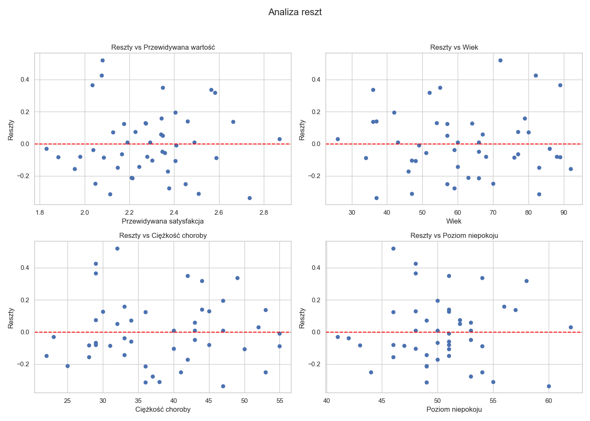
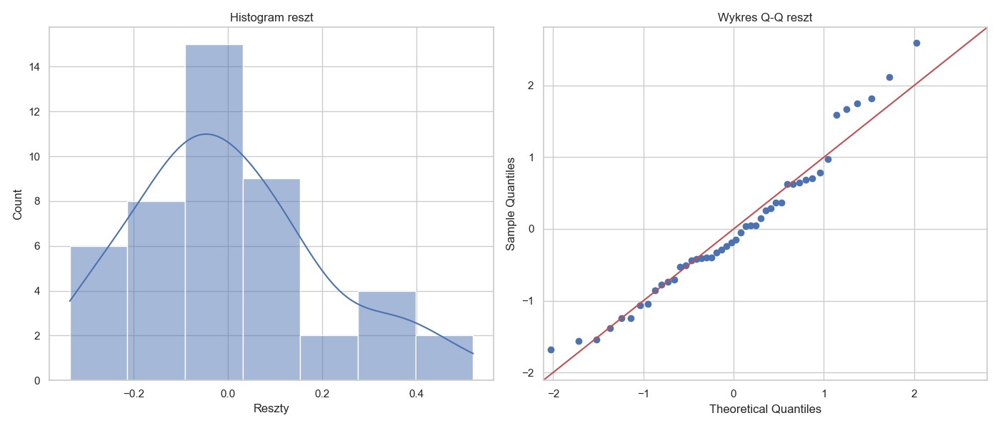

# Raport z listy 5

Jakub Kowalczyk

## Zadanie 1

### a)

$$ Y = \beta_0 + \beta_1 X_{wiek} + \beta_2 X_{ciężkość} + \beta_3 X_{niepokój} + \epsilon $$

Obliczone parametry regresji:

| Parametr   |   Teoretycznie |   Biblioteka |
|:-----------|---------------:|-------------:|
| Intercept  |       1.05324  |     1.05324  |
| Wiek       |      -0.005861 |    -0.005861 |
| Ciężkość   |       0.001928 |     0.001928 |
| Niepokój   |       0.030148 |     0.030148 |

Równanie regresji:
$$ Satysfakcja = 1.0532 - 0.0059 \cdot Wiek + 0.0019 \cdot Ciężkość + 0.0301 \cdot Niepokój $$

### b)

Współczynnik determinacji $R^2$ oraz wynik testu F dla ogólnej istotności modelu ($F(3, 42) = 16.54$):

$H_0: \beta_1 = \beta_2 = \beta_3 = 0$

$H_1: \exists_{i \in \{1, 2, 3\}} : \beta_i \neq 0$

| Metryka      |   Teoretycznie |   Biblioteka |
|:-------------|---------------:|-------------:|
| R^2          |    0.541548    |  0.541548    |
| Statystyka F |   16.5376      | 16.5376      |
| p-wartość F  |    3.04311e-07 |  3.04311e-07 |

**Konkluzja:**
Ponieważ p-wartość jest znacznie mniejsza od poziomu istotności $\alpha = 0.05$, **odrzucamy hipotezę zerową**. Istnieje istotna statystycznie zależność liniowa między rozważanymi zmiennymi objaśniającymi a satysfakcją pacjenta. Model wyjaśnia ok. 54% zmienności satysfakcji.

### c)

95% przedziały ufności oraz wyniki testów t-Studenta ($t(42)$) dla poszczególnych współczynników

$H_0: \beta_i = 0$

$H_1: \beta_i \neq 0$

| Zmienna   | CI (Teor)         | CI (Bibl)         |   t-stat (Teor) |   t-stat (Bibl) |   p-val (Teor) |   p-val (Bibl) |
|:----------|:------------------|:------------------|----------------:|----------------:|---------------:|---------------:|
| Intercept | (-0.1854, 2.2919) | [-0.1854, 2.2919] |          1.716  |          1.716  |      0.093537  |      0.093537  |
| Wiek      | (-0.0121, 0.0004) | [-0.0121, 0.0004] |         -1.8973 |         -1.8973 |      0.064678  |      0.064678  |
| Ciężkość  | (-0.0097, 0.0136) | [-0.0097, 0.0136] |          0.3332 |          0.3332 |      0.74065   |      0.74065   |
| Niepokój  | (0.0115, 0.0488)  | [0.0115, 0.0488]  |          3.2569 |          3.2569 |      0.0022323 |      0.0022323 |

**Wnioski:**

- **Wiek:** p-wartość $\approx 0.065 > 0.05$. Brak podstaw do odrzucenia $H_0$. Zmienna nie jest istotna statystycznie na poziomie 0.05, choć jest bliska granicy istotności.
- **Ciężkość choroby:** p-wartość $\approx 0.74 > 0.05$. Brak podstaw do odrzucenia $H_0$. Zmienna nie jest istotna statystycznie.
- **Poziom niepokoju:** p-wartość $\approx 0.002 < 0.05$. **Odrzucamy $H_0$**. Zmienna jest istotna statystycznie.

**Związek z przedziałami ufności:**
Przedziały ufności dla zmiennych nieistotnych statystycznie (Wiek, Ciężkość) zawierają zero. Przedział ufności dla zmiennej istotnej (Niepokój) nie zawiera zera (jest w całości dodatni), co potwierdza wniosek z testu t.

### d)

Wykresy reszt względem wartości przewidywanych oraz poszczególnych zmiennych objaśniających:

Rozkład reszt (Histogram i wykres Q-Q):

**Test Shapiro-Wilka:**
- Statystyka W = 0.962864
- p-wartość = 0.1481

**Wniosek:**
P-wartość testu Shapiro-Wilka jest większa od 0.05, zatem nie ma podstaw do odrzucenia hipotezy o normalności rozkładu reszt. Wykres Q-Q potwierdza dobre dopasowanie do rozkładu normalnego. Na wykresach rozrzutu nie widać nietypowych tendencji ani wartości odstających.

### e)

Porównujemy **model pełny** (Wiek, Ciężkość, Niepokój) z **modelem zredukowanym** zawierającym tylko zmienną **Niepokój**.

Hipotezy:
- $H_0: \beta_{wiek} = \beta_{ciężkość} = 0$
- $H_1: \beta_{wiek} \neq 0$ lub $\beta_{ciężkość} \neq 0$

Wyniki ogólnego testu F ($F(2, 42) = 4.21$):

| Metryka      |   Teoretycznie |   Biblioteka |
|:-------------|---------------:|-------------:|
| Statystyka F |       4.21141  |     4.21141  |
| p-wartość    |       0.021531 |     0.021531 |

**Konkluzja:**
Ponieważ p-wartość ($0.0215$) jest mniejsza od $\alpha = 0.05$, **odrzucamy hipotezę zerową**. Oznacza to, że model pełny jest lepszy niż model oparty wyłącznie na poziomie niepokoju.
